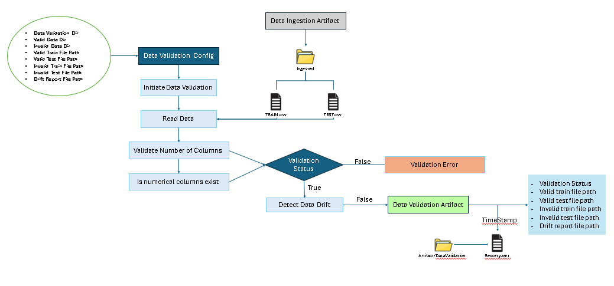

# ETL Pipeline

## Data Ingestion Flow

## Data Validation Flow
- Schema Validation
- Column Validation
#### - Data Drift: 
Data drift happens when the statistical properties of input data change over time compared to the data used to train the model. Because of this shift, the model may start giving less accurate predictions.

Simple example:
A model trained on customer data from 2022 may perform poorly in 2025 if user behavior, market trends, or demographics have changed.

Types of Data Drift:
- Covariate drift: Input features distribution changes (e.g., age, income patterns shift)
- Prior probability drift: Distribution of target variable changes (e.g., more fraud cases than before)
- Concept drift: Relationship between inputs and output changes (e.g., customer behavior evolves)
 
 

